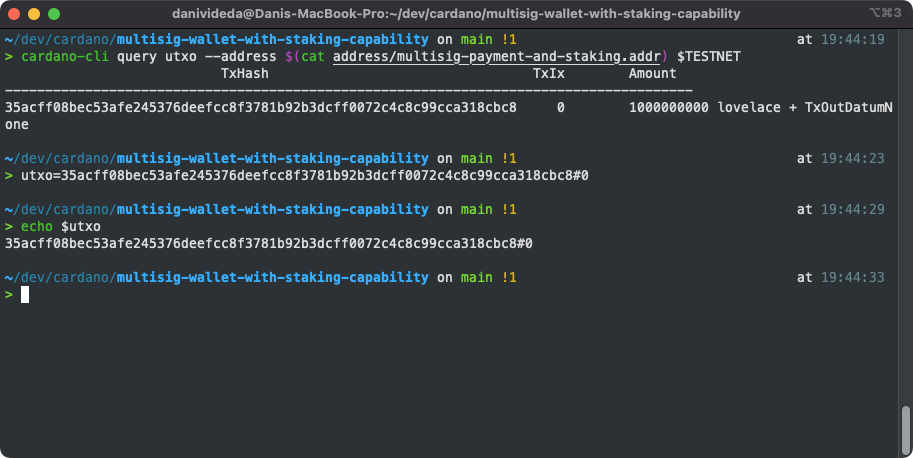
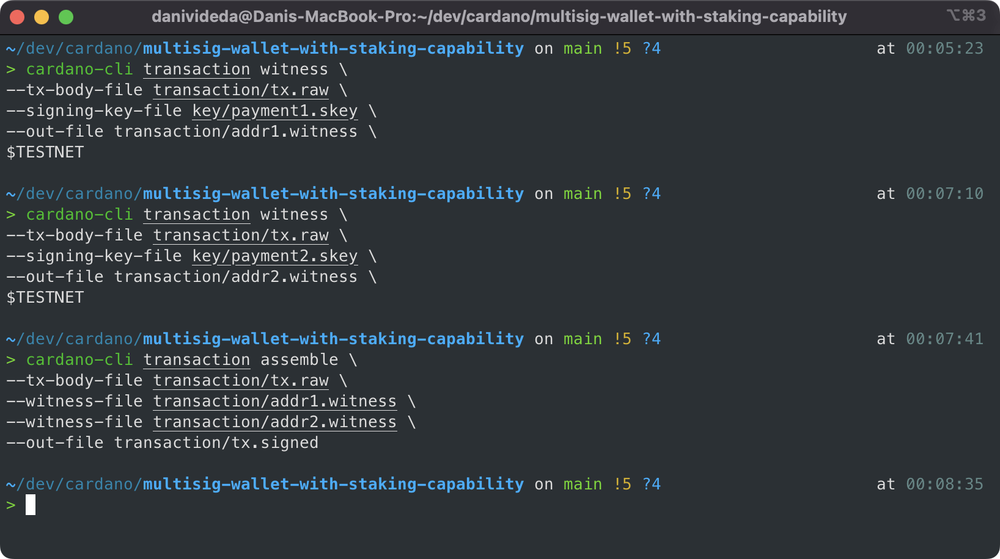
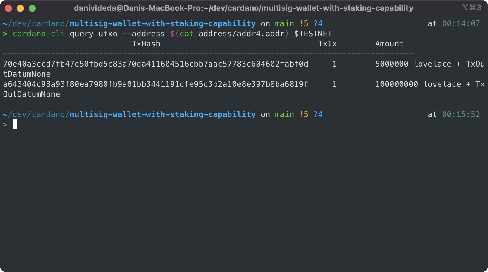

# Multi Signature Wallet for Cardano with Staking Capability
Multi Signature wallet (or multisig wallet) means a wallet that is not owned by a single entity or a person.
When using this wallet, transactions must be approved by a group of people that are responsible for this wallet.
The ***use-case*** for such a wallet is for an organization or a team who wants to create a *'Treasury'* that will hold their ADA.

## General overview
1. Instead of using one personal Wallet Address, we will use ‘Script Address’ to hold the funds
2. A script address is just like any other Cardano wallet address, where you can hold ADA, and send ADA from / to the address. The difference is, this wallet is not owned by a single ‘private key’.
3. This script address will have a pre-defined rules to only spend its UTXO if a certain conditions are met. This will defined in a script policy (a JSON structured file)
4. For this example, we will set a condition that **the script can only send ADA if a certain number of people specified in the script approve the transaction**
5. We will also create a script address that could also be staked, and withdraw the rewards together


## How it works
1. Create the script policy and the script address:
   1. `multisig-payment-policy.script` → rules for doing regular transaction (payment key)
   2. `multisig-stake-policy.script` → rules for withdrawing staking rewards (staking key)
   3. Creating the script address would be combining `multisig-payment-policy.script` and `multisig-stake-policy.script` together and then produce `multisig-payment-and-stake.addr`
2. This script will contain following information:
   1. List of wallet that are allowed to sign the transaction
   2. Minimum number of wallet required to validate transaction
   3. i.e: from 5 wallets listed, it will only requires 3 wallet to sign a transaction
3. Send ADA to this script address as treasury
4. To use the fund from this script address:
   1. One person would create a `Tx.raw` file that will consume `UTxO` from this script address – this is a transaction file that haven’t been signed by anyone, therefore it cannot be submitted into the blockchain
   2. The raw transaction would then be sent to each participants, and each of them will “sign” the `tx.raw` file, and it will output a `tx-person-1.witness` file
   3. Collecting `*.witness` files from the participants, one person would **“combine and build”** the `*.witness` files, and sign the `tx.raw` to become `Tx.signed`
   4. Submit the signed transaction into the blockchain

# Detailed Steps
**DISCLAIMER**: You don’t have to download the Cardano full node. At the end, it only needs one person to submit the transaction. Other person would just use cardano-cli to sign the transaction locally.

## Installing `cardano-cli`
1. Open [https://github.com/input-output-hk/cardano-node#executables](https://github.com/input-output-hk/cardano-node#executables)
2. Download the binary (executables) for your OS
3. Extract `cardano-cli` into `~/.local/bin/` folder (For Linux and MacOS user)
4. `$ chmod +x cardano-cli` to turn it into executable binary
5. Include that `bin/` path into `.bashrc` or `.zshrc` (export PATH="\$HOME/.local/bin/:$PATH”)
6. Open terminal (or relaunch it, if you already opened it)
7. Type `cardano-cli` and press enter.

## Creating Wallets
Every participants have to create their own private and public key pair, using `cardano-cli`. This is done locally and doesn’t require connection or `cardano-node` operations

*Note* :
1. Each participant have to create this new wallet using `cardano-cli`
2. It is recommended to separate this wallet from your main wallet, because the process of signing transaction don’t require fees (because the fee will be paid using the fund from script address)
3. Keep your **private-key** safe, don’t lose it.

Create Wallets:
1. Create a key-pair for payment and staking key
   ```bash
    cardano-cli address key-gen --verification-key-file payment.vkey --signing-key-file payment.skey
    cardano-cli stake-address key-gen --verification-key-file stake.vkey --signing-key-file stake.skey
   ```
    `.skey` → signing key. In other words, your private key (don’t share this with anyone)

    `.vkey` → verify key. Meaning, the public key

    *Why create `payment` keys and `stake` keys*? → In Shelley, every Cardano wallet address consist of 2 different element. The `payment` element for sending and receiving ADA, and the `stake` element to control and receive rewards from staking. Both `payment` and `stake` keys are required to build the wallet address later (e.g `addr1qy..xfqp5`). 
2. Save the `payment.vkey` hash
   ```bash
    cardano-cli address key-hash --payment-verification-key-file payment.vkey > payment.hash
    cardano-cli address key-hash --stake-verification-key-file stake.vkey > stake.hash
   ```
3. **Remember that each participant have to follow this step** and later share their `payment.hash` and `stake.hash` to that one person who will create the script policy and script address

For this demonstration, we will use 4 different wallet accounts. The participants would be represented by `addr1`, `addr2`, and `addr3`. The destination address will be `addr4`. All example files already provided in `address/` and `key/` folder.

I suggest you to generate your own key-pair and then replace the existing files on `key/`, `policy/`, and `address/` folders. Please feel free to fork this repository and experiment it yourself!

### Generating four new wallets
```bas8
cardano-cli address key-gen --signing-key-file key/payment1.skey --verification-key-file key/payment1.vkey
cardano-cli address key-gen --signing-key-file key/payment2.skey --verification-key-file key/payment2.vkey
cardano-cli address key-gen --signing-key-file key/payment3.skey --verification-key-file key/payment3.vkey
cardano-cli address key-gen --signing-key-file key/payment4.skey --verification-key-file key/payment4.vkey

cardano-cli stake-address key-gen --signing-key-file key/stake1.skey --verification-key-file key/stake1.vkey
cardano-cli stake-address key-gen --signing-key-file key/stake2.skey --verification-key-file key/stake2.vkey
cardano-cli stake-address key-gen --signing-key-file key/stake3.skey --verification-key-file key/stake3.vkey
cardano-cli stake-address key-gen --signing-key-file key/stake4.skey --verification-key-file key/stake4.vkey

cardano-cli address build --payment-verification-key-file payment1.vkey --stake-verification-key-file stake1.vkey $TESTNET --out-file address/addr1.addr
cardano-cli address build --payment-verification-key-file payment2.vkey --stake-verification-key-file stake2.vkey $TESTNET --out-file address/addr2.addr
cardano-cli address build --payment-verification-key-file payment3.vkey --stake-verification-key-file stake3.vkey $TESTNET --out-file address/addr3.addr
cardano-cli address build --payment-verification-key-file payment4.vkey --stake-verification-key-file stake4.vkey $TESTNET --out-file address/addr4.addr

cardano-cli address key-hash --payment-verification-key-file key/payment1.vkey > key/payment1.hash
cardano-cli address key-hash --payment-verification-key-file key/payment2.vkey > key/payment2.hash
cardano-cli address key-hash --payment-verification-key-file key/payment3.vkey > key/payment3.hash
cardano-cli address key-hash --payment-verification-key-file key/payment4.vkey > key/payment4.hash

cardano-cli address key-hash --stake-verification-key-file key/stake1.vkey > key/stake1.hash
cardano-cli address key-hash --stake-verification-key-file key/stake2.vkey > key/stake2.hash
cardano-cli address key-hash --stake-verification-key-file key/stake3.vkey > key/stake3.hash
cardano-cli address key-hash --stake-verification-key-file key/stake4.vkey > key/stake4.hash
```


## Creating the Script Policy and Script Address
1. Create `multisig-payment-policy.script` with following content
   ```JSON
   {
   "type": "atLeast8,
   "required": 2,
   "scripts": [
         {
            "type": "sig",
            "keyHash": "08d4afee7053ee63d6087cf2cbc729110affa3fd0b297c54f641bd0c"
         },
         {
            "type": "sig",
            "keyHash": "6ac2bd0c8c2c1413a1d96d46f80904911b1a2402f6e5806f8e4d7b2b"
         },
         {
            "type": "sig",
            "keyHash": "65a88230d95ac40fb4eaa17c94158b37606d4fe340b7e74e6da76e80"
         },
      ]
   }
   ```
2. Create `multisig-stake-policy.script` with following content
   ```JSON
   {
   "type": "atLeast",
   "required": 2,
   "scripts": [
         {
            "type": "sig",
            "keyHash": "44a6a1caeb04280018ed57771a7376ae631ea32e3c4985dfed03a9ef"
         },
         {
            "type": "sig",
            "keyHash": "a26d43c5e1c29efbdef1fb25294dbe02b6d956f9ace585dc6ce24b73"
         },
         {
            "type": "sig",
            "keyHash": "29801b566671726c859d35164c3961cea942ddfa64f4f0d4788ac763"
         },
      ]
   }
   ```
3. Further information for using different script conditions: [Link](https://github.com/input-output-hk/cardano-node/blob/master/doc/reference/simple-scripts.md)
4. The `keyHash` on `multisig-payment-policy.script` is `payment.hash` from each participants
5. The `keyHash` on `multisig-stake-policy.script` is `stake.hash` from each participants
6. The `required` value is the minimum number of people needs to sign a transaction (as specified in `multisig-payment-policy.script`), or to witdraw the staking rewards (as specified in `multisig-stake-policy.script`).
7. Build the **Script Address**
   ```bash
   # env variables
   TESTNET="--testnet-magic 1097911063" # (for `bash` user)
   TESTNET=(--testnet-magic 1097911063) # (for `zsh` user)
   ```
   ```bash
   cardano-cli address build \
   --payment-script-file script/multisig-payment-policy.script \
   --stake-script-file script/multisig-stake-policy.script \
   $TESTNET \
   --out-file address/multisig-payment-and-stake.addr
   ```
   This will generate a script address into `multisig-payment-and-staking.addr`
8. Fund the script address with [Cardano Faucet Testnet](https://testnets.cardano.org/en/testnets/cardano/tools/faucet/)
9. Done! You just created a Multisig Wallet with staking capability!
10. You can now send fund into this script address for Treasury management or any other use-cases

## Creating and Signing a Transaction
### Build the transaction `tx.raw`
***Note: the person who will build this must have cardano-node testnet or mainnet running in the background***
1. Query the UTXO of the script address
2. In terminal, save the TxHash#TxIndex as environment variable. Like so:
   
3. Build the transaction, using the utxo and `multisig-payment-policy.script` 
   ```bash
   cardano-cli transaction build \
   --tx-in $utxo \
   --tx-out $(cat address/addr4.addr)+5000000 \ # destination address + lovelaces
   --change-address $(cat address/multisig-payment-and-stake.addr) \ # send back the remaining ADA
   --tx-in-script-file script/multisig-payment-policy.script \ # payment-policy is used because it's about performing transaction
   --witness-override 2 \ # number of people required to sign this transaction (will use .witness file later)
   $TESTNET \
   --out-file transaction/tx.raw
   ```
   In this example, we will send 5ADA to `addr4`, and it will generate a `tx.raw` file

### Sign the transaction with witness
1. Build witness with `payment1.skey` and the `tx.raw`
2. We only need 2 witness, which will be from `addr1` and `addr2` wallet
   ```bash
   cardano-cli transaction witness \
   --tx-body-file transaction/tx.raw \ # provide the raw transaction file
   --signing-key-file key/payment1.skey \ # input signing key
   --out-file transaction/addr1.witness \ # output for witness file
   $TESTNET
   ```
3. Sign the transaction using 2 witness files
   ```bash
   cardano-cli transaction assemble \
   --tx-body-file transaction/tx.raw \
   --witness-file transaction/addr1.witness \
   --witness-file transaction/addr2.witness \
   --out-file transaction/tx.signed
   ```
   
4. Finally, submit it into the blockchain
   ```bash
   cardano-cli transaction submit --tx-file transaction/tx.signed $TESTNET
   ```
5. Check if `addr4` got the transaction
   ```bash
   cardano-cli query utxo --address $(cat address/addr4.addr) $TESTNET
   ```
   

   You can see the UTXO for `5 ADA` at the top of the list

**Congratulations! You just created a transaction using multi-signature!**

## Delegating and Withdrawing Staking Reward
**TBD**